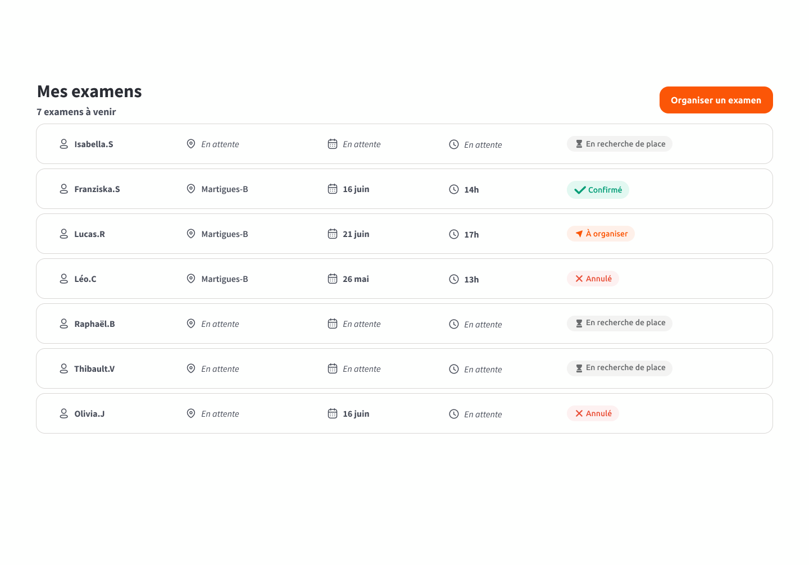

# Test Technique d'En Voiture Simone sur le développement frontend


## Objectif
L'objectif est de créer une application front-end en Angular qui interagit avec un backend Node.js mock. 
Le but de ce test sera de servir de base de discussion à l'entretien technique, en proposant un code de qualité.

### Durée estimée
2 à 3 heures

## Instructions

L'objectif est de faire une application minimale de gestions des examens à destination de nos enseignants.

#### Fonctionnalités de l'application front-end
1. **Affichage de la liste des examens  :**
   - Une page ou une vue qui affiche la liste des items récupérés du serveur via l'endpoint `GET /api/exams`.
2. **Ajout d'un nouvel examen :**
   - Un formulaire ou une interface qui permet d'ajouter un nouvel item via l'endpoint `POST /api/exams`, lors du clic sur le bouton "Organiser un examen".

Le rendu devra s'inspirer du mockup suivant :



### Conteneurisation avec Docker
L'application doit pouvoir être lancée avec une simple commande :

``` docker compose up ```

Il est suggéré de :
1. **Créer un Dockerfile pour le backend Node.js.**
2. **Créer un Dockerfile pour l'application front-end.**
3. **Utiliser le fichier `docker-compose.yml` fourni pour orchestrer les services :**
   - Un service pour le backend.
   - Un service pour le front-end.

### Aides techniques

3 fichiers sont fournis, pour permettre de se concentrer sur la partie front-end :
- Un swagger qui décrit le format de l'API et les modèles de données. [exam-api.yml](exam-api.yml)
- Le [docker-compose.yml](docker-compose.yml), qui nécessitera les Dockerfile
- Le [server.js](server.js), qui contient un serveur mock.

## Livrable attendus
L'ensemble des fichiers permettant le lancement de l'application via la commande suivante :

``` docker compose up ```

### Critères d'évaluation
1. **Fonctionnalité :** L'application fonctionne comme attendu et interagit correctement avec le backend.
2. **Modularisation :** Les composants sont bien structurés et modulaires. L'architecture retenue permettra d'ajouter facilement de nouvelles fonctionnalités.
3. **Code propre :** Le code est bien organisé, lisible et facilement compréhensible. En bref, il doit être "production-ready"!
4. **Conteneurisation :** L'application est correctement conteneurisée et peut être lancée avec Docker Compose.

Si vous avez identifié des choses imparfaites dans votre code (par manque de temps par exemple), ajoutez les au README pour qu'on puisse en discuter!

Bonne chance !
